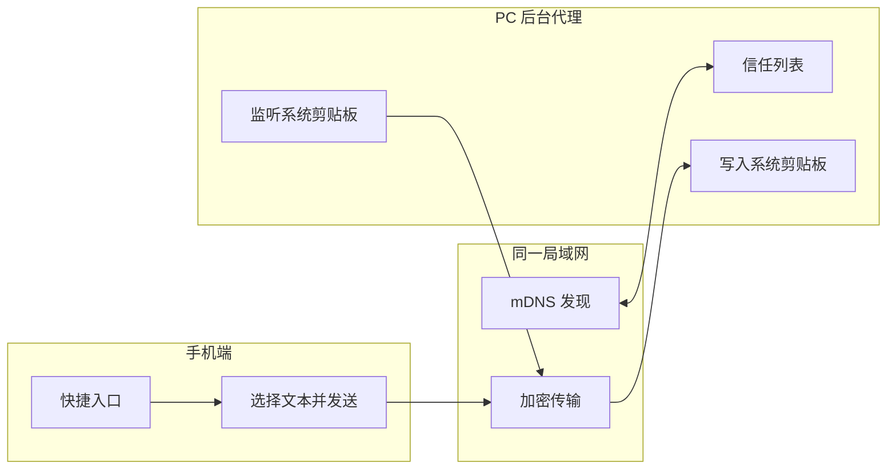

# rs-cp

跨设备文本剪贴板同步，优先级是：**占用最小、速度最快、体验最直观**。

## 目标

- PC 端默认后台常驻
- 手机端通过快捷入口发送文本
- 局域网自动发现设备
- 仅对已信任设备广播
- 后台自动刷新可信设备 IP
- 第一版只做纯文本
- 优先保持极小包体和极低后台占用

## 架构



## 交互原则

- PC 端不做主窗口
- 只保留最轻量后台进程
- 手机端保留一个明确的发送动作
- 设备必须先进入信任列表，才允许广播

## 代码结构

- `crates/rs-cp-core`：核心模型与协议类型
- `crates/rs-cp-daemon`：桌面后台守护进程入口
- `docs/discovery-protocol.md`：设备发现和文本传输协议
- `docs/pc-mvp.md`：PC 端 MVP 使用说明
- `docs/release.md`：GitHub Actions 发布说明
- `docs/mobile-ios-plan.md`：iOS 快捷触发 App 计划

## 发布

PC 端通过 GitHub Actions 自动打包，不要求用户本地构建。见 `docs/release.md`。

## PC 端命令

```sh
cargo run -p rs-cp-daemon -- status
cargo run -p rs-cp-daemon -- discover
cargo run -p rs-cp-daemon -- announce
cargo run -p rs-cp-daemon -- trust <id> <name> <platform> [host]
cargo run -p rs-cp-daemon -- run
```

`run` 会监听本机剪贴板变化，并把纯文本发送给所有带 `host` 的可信设备。
