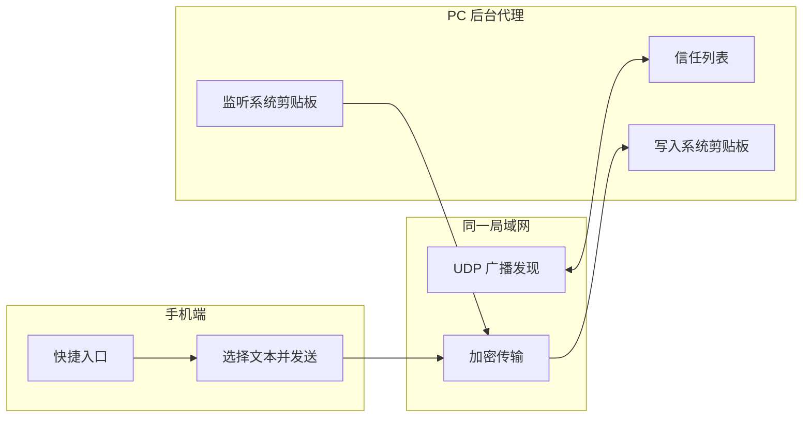

# span

跨设备数据互通，第一版先做文本剪贴板同步。优先级是：**占用最小、速度最快、体验最直观**。

## 目标

- PC 端默认后台常驻
- 手机端通过快捷入口发送文本
- 局域网自动发现设备
- 仅对已信任设备广播
- 后台自动刷新可信设备 IP
- 第一版只做纯文本
- 优先保持极小包体和极低后台占用

## 架构



## 交互原则

- PC 端不做主窗口
- 只保留最轻量后台进程
- 手机端保留一个明确的发送动作
- 设备必须先进入信任列表，才允许广播

## 代码结构

- `crates/span-core`：核心模型与协议类型
- `crates/span`：桌面后台守护进程入口
- `docs/discovery-protocol.md`：设备发现和文本传输协议
- `docs/pc-mvp.md`：PC 端 MVP 使用说明
- `docs/release.md`：GitHub Actions 发布说明
- `apps/android`：Android V1 App（双向文本、剪贴板一键发送 / 分享菜单 / Quick Settings Tile / 接收服务）
- `apps/android/README.md`：Android 构建、配对和限制
- `docs/mobile-ios-plan.md`：暂缓的 iOS 方案草稿（当前不参与 V1）

## npm 安装（桌面端）

桌面端提供 npm 安装器。npm 包本身只包含极小的 Node 启动脚本，安装时根据当前系统下载对应的 Rust 二进制，不引入 Electron 或其他重型运行时。

```sh
npm install -g span-desktop
span install
```

`span install` 会把 daemon 注册为 macOS LaunchAgent、Windows 登录任务或 Linux 自启动项，因此不需要让终端窗口一直开着。

本地测试 npm 包：

```sh
cargo build --release -p span
cd npm/span-desktop
npm pack
SPAN_LOCAL_BINARY="$PWD/../../target/release/span" \
  npm install --prefix /tmp/span-npm-prefix ./span-desktop-0.1.2.tgz
/tmp/span-npm-prefix/node_modules/.bin/span status
```

正式 npm 安装会下载 GitHub Release 中对应平台的包；本地测试通过 `SPAN_LOCAL_BINARY` 避免依赖尚未发布的 Release。

## 发布

PC 端通过 GitHub Actions 自动打包，不要求用户本地构建。见 `docs/release.md`。

iOS 当前暂缓，不纳入 V1 构建和发布；先把 Android → PC 的低占用文本链路验证稳定。

## PC 端命令

```sh
cargo run -p span -- status
cargo run -p span -- discover
cargo run -p span -- announce
cargo run -p span -- trust <id>
cargo run -p span -- trust <id> <name> <platform> [host] [public-key]
cargo run -p span -- start
```

`start` 会在后台启动 daemon 并立即返回；`run` 仅用于前台调试。

## Android 端

Android V1 支持 Android → PC 主动发送，也支持 PC → Android 接收并写入系统剪贴板；手机端不做后台剪贴板读取监听。详见 [`apps/android/README.md`](apps/android/README.md)。

```sh
cd apps/android
JAVA_HOME=$(/usr/libexec/java_home -v 21) ./gradlew :app:testDebugUnitTest :app:assembleDebug
```
