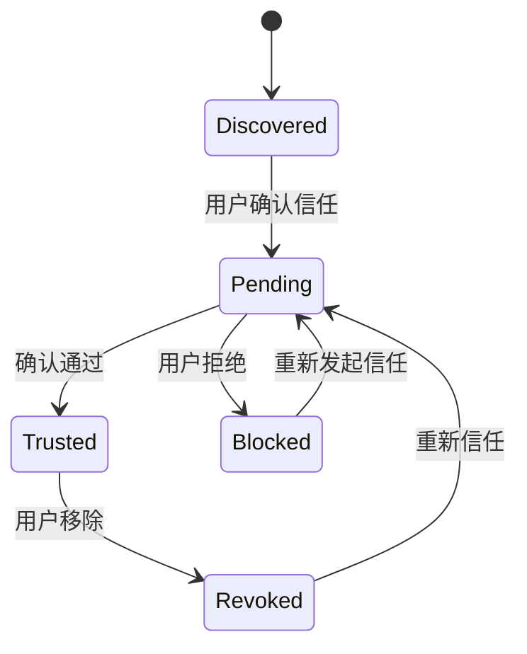
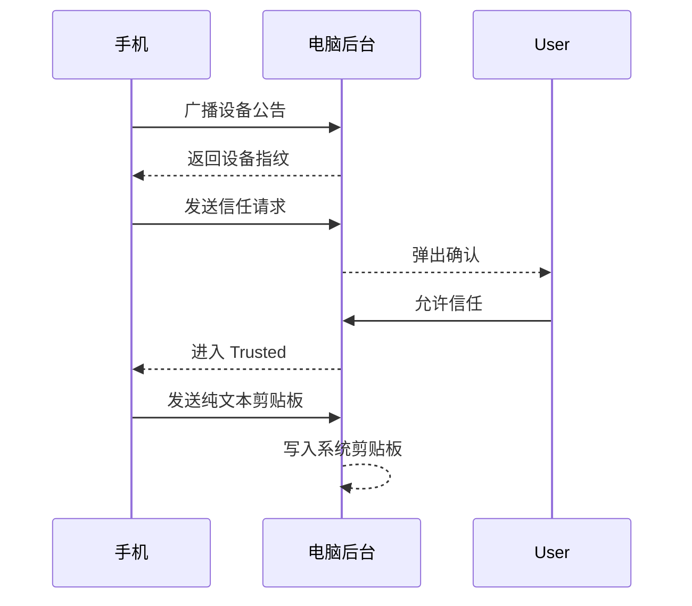

# 信任与广播协议

## 设备状态

```mermaid
stateDiagram-v2
    [*] --> Discovered
    Discovered --> Pending: 用户确认信任
    Pending --> Trusted: 确认通过
    Pending --> Blocked: 用户拒绝
    Trusted --> Revoked: 用户移除
    Blocked --> Pending: 重新发起信任
    Revoked --> Pending: 重新信任
```

## 消息流

```mermaid
sequenceDiagram
    participant Phone as 手机
    participant PC as 电脑后台

    Phone->>PC: 广播设备公告
    PC-->>Phone: 返回设备指纹
    Phone->>PC: 发送信任请求
    PC-->>User: 弹出确认
    User->>PC: 允许信任
    PC-->>Phone: 进入 Trusted
    Phone->>PC: 发送纯文本剪贴板
    PC-->>PC: 写入系统剪贴板
```

## 广播规则

- 只对 `Trusted` 设备广播
- 未信任设备不会收到文本
- 用户可以从任一端移除设备
- 第一版只传纯文本

## 当前实现

PC MVP 当前使用 `46792/UDP` 做局域网发现，使用 `46793/TCP` 做文本传输。详细格式见 `docs/discovery-protocol.md`。
